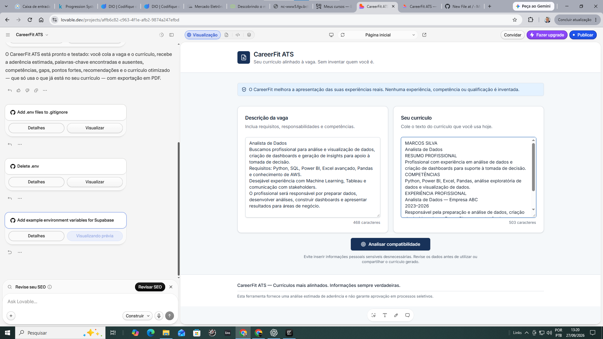
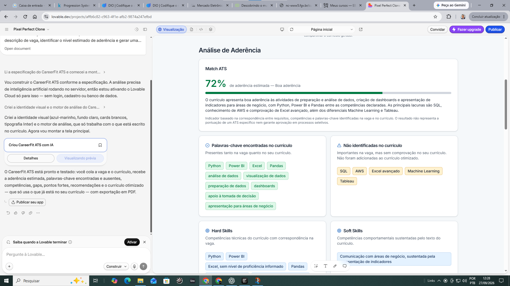
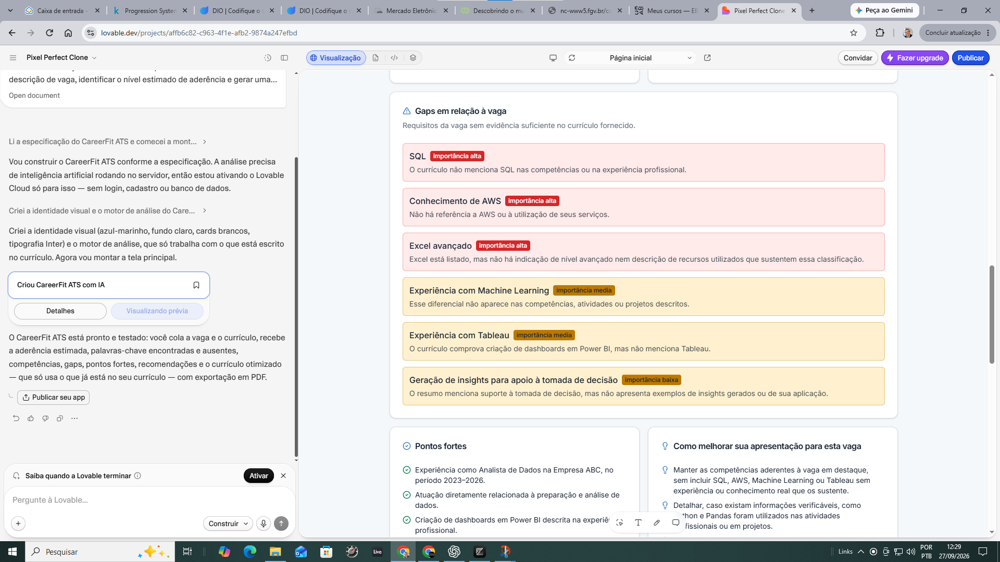
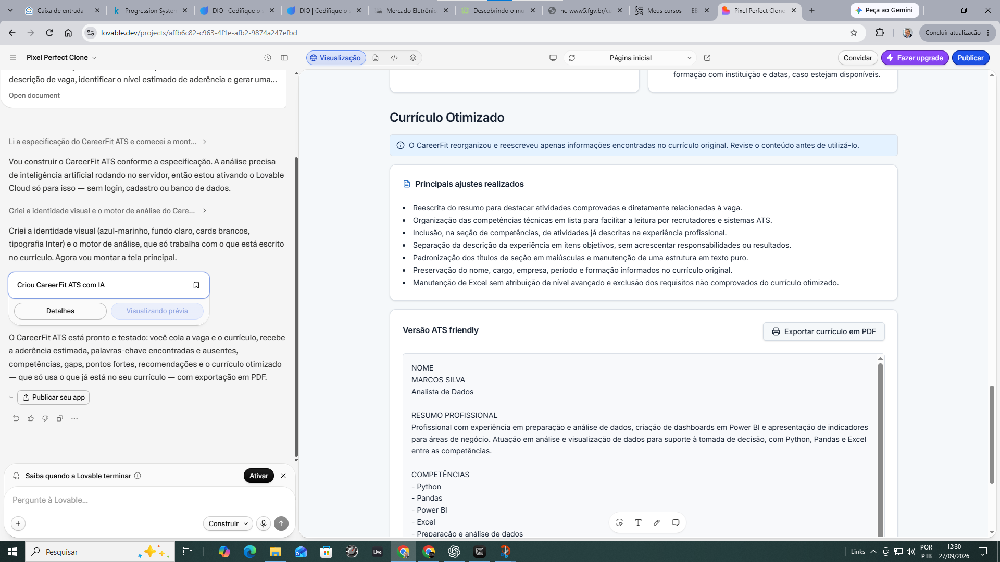

<p align="center">
  
</p>


 


# CareerFit ATS

> **Seu currículo alinhado à vaga. Sem inventar quem você é.**

O **CareerFit ATS** é uma aplicação web desenvolvida como projeto do **Santander / DIO — Trilha Lovable 2026**.

A aplicação compara o conteúdo de um currículo com a descrição de uma vaga, estima o nível de aderência, identifica palavras-chave e competências relevantes, aponta gaps e gera uma versão do currículo otimizada para sistemas ATS (*Applicant Tracking Systems*).

O princípio central do projeto é simples:

> **O CareerFit pode melhorar a forma como o candidato apresenta sua experiência, mas nunca inventa experiência, competência ou qualificação que ele não possui.**

---

## Aplicação publicada

**CareerFit ATS:**  
https://careerfit-ats.lovable.app

---

---

## 📸 Demonstração

### 1. Comparação entre vaga e currículo

O usuário insere a descrição da oportunidade e o conteúdo do currículo para iniciar a análise de compatibilidade.



### 2. Análise de aderência

O CareerFit ATS estima a aderência entre currículo e vaga, identifica palavras-chave presentes e ausentes e analisa competências relevantes.



### 3. Gaps e recomendações

A aplicação identifica requisitos da vaga que não possuem evidência suficiente no currículo, destaca pontos fortes e apresenta recomendações — sem inventar experiências ou qualificações.



### 4. Currículo otimizado para ATS

Com base exclusivamente nas informações fornecidas pelo candidato, o CareerFit reorganiza e reescreve o currículo para melhorar sua apresentação e compatibilidade com sistemas ATS.



> **Princípio do projeto:** o CareerFit pode melhorar a forma como a experiência profissional é apresentada, mas nunca inventa experiência, competência ou qualificação.

---

## O problema

Muitos candidatos possuem experiências compatíveis com uma oportunidade, mas seus currículos não apresentam essas informações de maneira suficientemente clara ou alinhada à linguagem utilizada na descrição da vaga.

Antes mesmo de chegar a um recrutador, o currículo pode passar por sistemas ATS responsáveis por organizar, filtrar e classificar candidaturas.

O CareerFit ATS foi criado para ajudar o candidato a:

- comparar seu currículo com uma vaga específica;
- identificar requisitos presentes e ausentes;
- visualizar competências relevantes;
- identificar gaps;
- receber recomendações de melhoria;
- reorganizar o currículo para uma estrutura mais adequada a ATS;
- preservar integralmente a veracidade das informações profissionais.

---

## Como funciona

O fluxo principal da aplicação é:

**Descrição da vaga + Currículo → Análise → Aderência → Keywords → Competências → Gaps → Recomendações → Currículo otimizado → PDF**

### 1. Descrição da vaga

O usuário cola o texto completo da oportunidade que deseja analisar.

### 2. Currículo

O usuário insere o conteúdo do currículo atual.

### 3. Análise de aderência

O CareerFit compara os dois conteúdos e apresenta um indicador percentual de aderência estimada.

O percentual não representa a pontuação de um ATS específico e não garante aprovação em um processo seletivo.

### 4. Palavras-chave

A aplicação separa:

- palavras-chave identificadas no currículo;
- palavras-chave relevantes da vaga que não foram identificadas.

### 5. Competências

Quando possível, são identificadas:

- Hard Skills;
- Soft Skills;
- requisitos relacionados à oportunidade.

### 6. Gaps

Requisitos presentes na vaga, mas não comprovados pelo currículo, são apresentados como gaps.

Esses requisitos **não são automaticamente incorporados ao currículo otimizado**.

### 7. Recomendações

O CareerFit sugere formas de melhorar a apresentação das experiências reais, como:

- reposicionar competências relevantes;
- melhorar a clareza;
- destacar experiências relacionadas à vaga;
- utilizar terminologia compatível quando semanticamente verdadeira;
- priorizar resultados e responsabilidades relevantes.

### 8. Currículo otimizado

A aplicação reorganiza e reescreve somente informações existentes no currículo original.

### 9. Exportação

O currículo otimizado pode ser exportado em **PDF**.

---

## Regra de integridade

Uma das decisões mais importantes do projeto foi impedir que a otimização do currículo introduzisse informações inexistentes.

O CareerFit pode:

- reorganizar conteúdo;
- melhorar a redação;
- destacar informações;
- alterar a ordem das informações;
- utilizar termos semanticamente equivalentes;
- tornar experiências existentes mais claras.

O CareerFit não pode inventar:

- experiências profissionais;
- empresas;
- cargos;
- datas;
- competências;
- ferramentas;
- tecnologias;
- certificações;
- formação;
- idiomas;
- resultados;
- métricas.

Quando uma competência solicitada pela vaga não pode ser comprovada pelo currículo, ela é apresentada como **gap**.

---

## Teste de integridade

Durante a validação do projeto foi realizado um teste controlado.

A vaga utilizada solicitava, entre outros requisitos:

- Python;
- SQL;
- Power BI;
- Excel avançado;
- Pandas;
- AWS;
- Machine Learning;
- Tableau.

O currículo de teste possuía:

- Python;
- Power BI;
- Excel;
- Pandas;
- análise de dados;
- visualização de dados.

### Resultado

O CareerFit identificou corretamente como não comprovados:

- SQL;
- AWS;
- Machine Learning;
- Tableau;
- Excel avançado.

Um comportamento particularmente importante ocorreu com **Excel**.

Embora o currículo informasse conhecimento em Excel, a aplicação não inferiu automaticamente proficiência avançada.

**Excel ≠ Excel avançado**

O requisito "Excel avançado" permaneceu classificado como gap.

Da mesma forma, SQL, AWS, Machine Learning e Tableau não foram adicionados ao currículo otimizado.

Esse teste validou na prática a principal regra do projeto:

> **Otimizar a apresentação sem fabricar experiência.**

---

## Exemplo de análise

No teste controlado, o CareerFit apresentou uma aderência estimada de **72%**, separando competências encontradas, requisitos não identificados e gaps relevantes.

> O percentual é um indicador interno de correspondência entre currículo e vaga e não representa a pontuação de um ATS comercial específico.

---

## Mega Prompt

A primeira versão da aplicação foi criada no Lovable a partir de um **Mega Prompt estruturado em Markdown**.

O prompt especificou:

- objetivo do produto;
- público-alvo;
- fluxo da aplicação;
- identidade visual;
- design system;
- estrutura da interface;
- análise de aderência;
- palavras-chave;
- Hard Skills e Soft Skills;
- gaps;
- recomendações;
- currículo otimizado;
- exportação em PDF;
- estados da aplicação;
- responsividade;
- acessibilidade;
- privacidade;
- regra contra fabricação de informações.

### Design System

Foi solicitado o uso de:

- **shadcn/ui**;
- azul-marinho como cor principal;
- azul como cor secundária;
- verde para indicadores positivos;
- amarelo/âmbar para atenção;
- vermelho para gaps críticos ou erros;
- fundo claro;
- cards brancos;
- tipografia Inter ou equivalente.

---

## Mega Prompt original

<details>
<summary><strong>Clique para visualizar o Mega Prompt utilizado</strong></summary>

```markdown

# CareerFit ATS

Crie uma aplicação web responsiva chamada **CareerFit ATS**.

## Objetivo do produto

O CareerFit ATS ajuda candidatos a comparar seu currículo com uma descrição de vaga, identificar o nível estimado de aderência e gerar uma versão do currículo mais adequada para sistemas ATS (Applicant Tracking Systems).

A aplicação deve analisar somente as informações fornecidas pelo usuário.

Princípio central:

**"Seu currículo alinhado à vaga. Sem inventar quem você é."**

A aplicação pode reorganizar, reescrever, resumir e destacar informações existentes no currículo, mas NUNCA deve inventar:

- experiências profissionais;
- cargos;
- empresas;
- datas;
- formação acadêmica;
- certificações;
- ferramentas;
- tecnologias;
- idiomas;
- competências;
- resultados;
- métricas;
- responsabilidades.

Se determinada competência ou requisito estiver presente na vaga, mas não puder ser comprovado pelo currículo fornecido, apresente-o como um GAP.

Nunca acrescente esse requisito ao currículo otimizado.

---

## Público-alvo

Profissionais procurando emprego e que desejam adaptar seu currículo para uma vaga específica sem inserir informações falsas.

A interface deve ser suficientemente simples para usuários sem conhecimento técnico.

---

## Design

Utilize **shadcn/ui** como design system.

Crie uma interface:

- clean;
- moderna;
- profissional;
- corporativa;
- tecnológica;
- acessível;
- responsiva.

Evite excesso de elementos decorativos, animações, gradientes ou aparência de landing page genérica criada por IA.

### Paleta

Utilize como referência:

- azul-marinho como cor principal;
- azul como cor secundária;
- verde apenas para indicadores positivos;
- amarelo/âmbar para atenção;
- vermelho somente para gaps críticos ou erros;
- fundo claro;
- cards brancos;
- bom contraste e espaçamento.

Utilize tipografia **Inter** ou outra sans-serif profissional equivalente.

---

## Header

No topo da aplicação apresente:

**CareerFit ATS**

Tagline:

**Seu currículo alinhado à vaga. Sem inventar quem você é.**

Inclua uma pequena identificação visual relacionada a carreira, documentos ou análise.

Não utilize elementos visuais excessivos.

---

## Aviso de integridade

Exiba de forma visível, mas discreta:

**CareerFit melhora a apresentação das suas experiências reais. Nenhuma experiência, competência ou qualificação é inventada.**

Esse princípio deve ser respeitado durante todo o processamento.

---

## Área de entrada

Crie dois campos principais lado a lado em desktop e empilhados em dispositivos móveis.

### Campo 1 — Descrição da vaga

Título:

**Descrição da vaga**

Placeholder:

"Cole aqui a descrição completa da oportunidade..."

Permita textos longos.

### Campo 2 — Currículo

Título:

**Seu currículo**

Placeholder:

"Cole aqui o conteúdo do seu currículo..."

Permita textos longos.

Mostre contador de caracteres de forma discreta.

---

## Botão principal

Abaixo dos campos crie um botão destacado:

**Analisar compatibilidade**

O botão só deve ficar habilitado quando os dois campos possuírem conteúdo.

Durante o processamento, mostrar estado de loading:

**Analisando currículo e vaga...**

---

## Resultado da análise

Após a análise, mostrar uma nova área chamada:

# Análise de Aderência

---

### 1. Match ATS

Mostrar um indicador percentual de 0 a 100.

Exemplo:

**82% de aderência estimada**

Utilize um componente visual simples, como barra de progresso ou indicador circular.

IMPORTANTE:

Não apresente esse percentual como a pontuação real de um ATS específico.

Mostrar abaixo:

"Indicador baseado na correspondência entre requisitos, competências e palavras-chave identificadas na vaga e no currículo. O resultado não representa a pontuação de um ATS específico nem garante aprovação em processos seletivos."

---

### 2. Palavras-chave

Criar duas áreas:

#### Encontradas no currículo

Mostrar palavras-chave relevantes presentes tanto na vaga quanto no currículo.

Utilizar badges.

#### Não identificadas no currículo

Mostrar palavras-chave importantes da vaga que não foram encontradas ou comprovadas no currículo.

Essas palavras NÃO devem ser automaticamente adicionadas ao currículo otimizado.

Utilizar badges visualmente diferentes.

---

### 3. Competências

Separar quando possível:

#### Hard Skills

Mostrar competências técnicas identificadas no currículo que correspondem à vaga.

#### Soft Skills

Mostrar competências comportamentais identificadas no currículo que tenham correspondência com a vaga.

Não inferir competências que não estejam sustentadas pelo texto fornecido.

---

### 4. Gaps identificados

Criar uma seção específica chamada:

**Gaps em relação à vaga**

Liste requisitos relevantes encontrados na descrição da vaga que não possuem evidência suficiente no currículo.

Para cada gap, mostrar:

- requisito;
- importância aparente para a vaga;
- indicação de que não foi identificado no currículo.

Exemplo:

"Python — requisito identificado na vaga, mas não encontrado no currículo fornecido."

Não adicionar esses gaps ao currículo otimizado.

---

### 5. Pontos fortes

Mostrar os principais fatores de aderência entre currículo e vaga.

Exemplos:

- experiência compatível;
- ferramentas correspondentes;
- conhecimentos;
- responsabilidades semelhantes;
- formação relevante;
- resultados relacionados.

Somente apresentar informações comprovadas pelo currículo.

---

### 6. Recomendações

Criar uma seção:

**Como melhorar sua apresentação para esta vaga**

Fornecer recomendações práticas.

Exemplos:

- reposicionar competências já existentes;
- destacar experiências relevantes;
- utilizar terminologia compatível com a vaga quando semanticamente equivalente;
- tornar resultados existentes mais visíveis;
- melhorar clareza e estrutura;
- reduzir informações pouco relevantes para aquela oportunidade.

Não recomendar que o usuário alegue possuir uma competência que não possui.

---

## Currículo ATS Friendly

Após a análise, criar uma seção:

# Currículo Otimizado

Gerar uma nova versão do currículo utilizando somente informações comprovadas pelo currículo original.

O currículo otimizado deve:

- utilizar estrutura simples;
- possuir títulos de seção claros;
- evitar tabelas complexas;
- evitar elementos que dificultem leitura por ATS;
- priorizar experiências relacionadas à vaga;
- utilizar palavras-chave da vaga somente quando forem verdadeiras em relação ao currículo;
- melhorar clareza;
- melhorar concisão;
- melhorar organização;
- manter informações factuais;
- preservar empresas, cargos e datas;
- preservar formação e certificações reais;
- preservar métricas quando existirem.

Nunca criar métricas ou resultados inexistentes.

---

## Estrutura sugerida do currículo

Quando as informações estiverem disponíveis, organizar em:

1. Nome e contato
2. Resumo profissional
3. Competências
4. Experiência profissional
5. Formação acadêmica
6. Certificações
7. Idiomas
8. Projetos relevantes

Não criar seções para as quais não existam informações no currículo original.

---

## Rastreabilidade

Acima do currículo otimizado, mostrar uma mensagem:

**O CareerFit reorganizou e reescreveu apenas informações encontradas no currículo original. Revise o conteúdo antes de utilizá-lo.**

Se possível, disponibilizar uma área chamada:

**Principais ajustes realizados**

Exemplos:

- resumo profissional reorganizado;
- competências relevantes reposicionadas;
- terminologia alinhada à vaga;
- experiências priorizadas;
- estrutura simplificada para leitura ATS.

---

## Exportação

Criar opção:

**Exportar currículo em PDF**

O PDF deve:

- possuir aparência profissional;
- ser legível;
- ter estrutura simples;
- utilizar texto selecionável sempre que tecnicamente possível;
- evitar gráficos, barras de habilidade e elementos que prejudiquem leitura ATS.

Se a exportação em PDF exigir implementação adicional, deixe a interface e a arquitetura preparadas para ela.

---

## Estados da aplicação

Crie estados adequados para:

- campos vazios;
- processamento;
- análise concluída;
- erro;
- conteúdo insuficiente.

Se o currículo fornecido tiver conteúdo insuficiente para uma análise responsável, informe o usuário em vez de inventar resultados.

---

## Privacidade

Mostrar uma mensagem discreta:

**Evite inserir informações pessoais sensíveis desnecessárias. Revise os dados antes de utilizar ou compartilhar o currículo gerado.**

Não criar alegações de segurança, criptografia ou armazenamento que não estejam realmente implementadas.

---

## Responsividade

A aplicação deve funcionar corretamente em:

- desktop;
- tablet;
- smartphone.

No desktop, os campos da vaga e currículo podem aparecer lado a lado.

No mobile, devem ficar empilhados.

---

## Acessibilidade

Utilizar:

- contraste adequado;
- labels nos campos;
- hierarquia clara de headings;
- estados de foco;
- botões identificáveis;
- textos legíveis.

---

## Rodapé

Criar rodapé simples:

**CareerFit ATS — Currículos mais alinhados. Informações sempre verdadeiras.**

Adicionar:

"Esta ferramenta fornece uma análise estimada de aderência e não garante aprovação em processos seletivos."

---

## Prioridade de implementação

Priorize primeiro o MVP funcional:

1. entrada da descrição da vaga;
2. entrada do currículo;
3. análise de aderência;
4. score estimado;
5. palavras-chave encontradas;
6. palavras-chave ausentes;
7. competências;
8. gaps;
9. recomendações;
10. currículo otimizado;
11. exportação em PDF.

Não implemente neste momento:

- login;
- cadastro;
- autenticação;
- banco de dados;
- histórico;
- pagamentos;
- dashboard administrativo;
- integração com e-mail.

Essas funcionalidades poderão ser adicionadas posteriormente.

---

## Critério principal de qualidade

O CareerFit ATS deve entregar uma experiência simples:

**Vaga + Currículo → Análise → Aderência → Gaps → Recomendações → Currículo ATS Friendly → PDF**

A aplicação deve parecer um produto profissional funcional, e não apenas uma demonstração visual.

O princípio mais importante de todo o sistema é:

**O CareerFit pode melhorar como o candidato apresenta sua experiência, mas nunca pode inventar experiência que ele não possui.**
```

</details>

---

## Evolução após a primeira geração

A construção foi realizada de forma incremental.

A prioridade foi manter o escopo concentrado no **MVP funcional**, evitando inicialmente recursos que não eram necessários para validar a proposta, como:

- login;
- autenticação;
- banco de dados;
- histórico de análises;
- dashboard;
- pagamentos;
- integração com e-mail.

Após a primeira geração, o foco foi validar:

1. funcionamento da análise;
2. identificação de palavras-chave;
3. identificação de gaps;
4. comportamento diante de competências ausentes;
5. geração do currículo otimizado;
6. exportação em PDF.

A decisão foi não adicionar funcionalidades apenas para aumentar a complexidade do projeto. O objetivo foi entregar uma aplicação pequena, funcional, testável e coerente com o problema proposto.

---

## Tecnologias utilizadas

- Lovable
- React
- TypeScript
- Vite
- Tailwind CSS
- shadcn/ui
- Supabase / Lovable Cloud
- Git
- GitHub

---

## Segurança e configuração

Variáveis de ambiente não são versionadas diretamente no repositório.

O arquivo `.env.example` documenta as variáveis necessárias sem armazenar valores de configuração.

```env
SUPABASE_PROJECT_ID=
SUPABASE_PUBLISHABLE_KEY=
SUPABASE_URL=
VITE_SUPABASE_PROJECT_ID=
VITE_SUPABASE_PUBLISHABLE_KEY=
VITE_SUPABASE_URL=
```

---

## Executando localmente

Clone o repositório:

```bash
git clone https://github.com/MCLG1661/careerfit-ats.git
```

Entre no diretório:

```bash
cd careerfit-ats
```

Instale as dependências:

```bash
npm install
```

Crie o arquivo `.env` com base no `.env.example` e configure as variáveis necessárias.

Execute o projeto:

```bash
npm run dev
```

---

## Possíveis evoluções

O MVP foi deliberadamente mantido enxuto.

Algumas evoluções possíveis são:

- exportação em `.docx`;
- histórico de análises;
- autenticação;
- dashboard de evolução do match;
- comparação entre diferentes versões do currículo;
- especialização por área profissional;
- análise de múltiplas vagas;
- SEO;
- GEO;
- internacionalização.

---

## Sobre o projeto

Projeto desenvolvido para o desafio:

**Santander / DIO — Trilha Lovable 2026**

### Autor

**Marcus Corrêa Lopes Guedes**

Linkedin: [Marcus Guedes](https://www.linkedin.com/in/marcusguedes/)

GitHub: [MCLG1661](https://github.com/MCLG1661)

---

## Aviso

O CareerFit ATS fornece uma análise estimada de aderência entre currículo e vaga.

A ferramenta não representa nem reproduz necessariamente os critérios utilizados por plataformas ATS específicas e não garante aprovação ou avanço em processos seletivos.

O conteúdo gerado deve ser revisado pelo usuário antes de ser utilizado.

---

**CareerFit ATS — Currículos mais alinhados. Informações sempre verdadeiras.**
